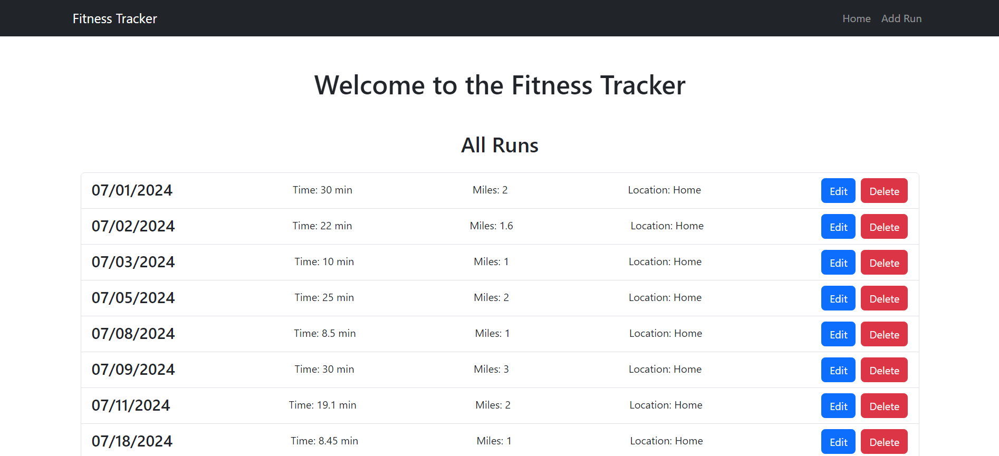
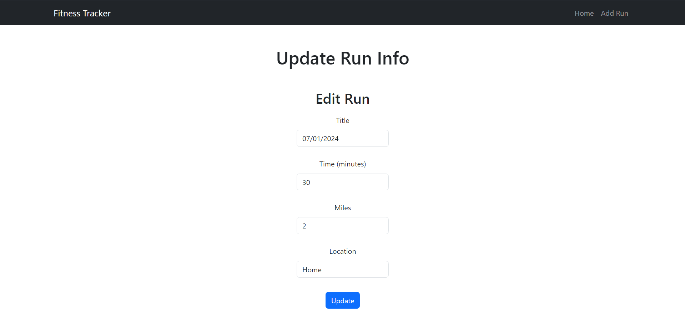
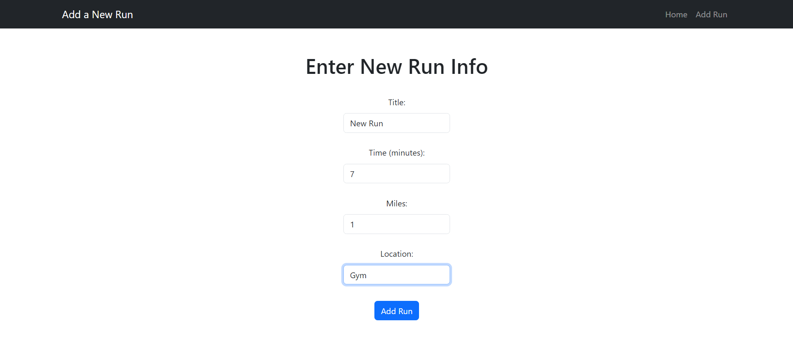

# Fitness Tracker Web Application

## Description

This is a full-stack fitness tracker web application that allows users to log their running activities, view past runs, and update or delete run records. The frontend is built with React and Bootstrap, while the backend uses Spring Boot with MongoDB for data storage.

## Features

- **Add a Run:** Submit new run records with details like title, time, miles, and location.
- **View Runs:** List all runs with options to view details.
- **Edit Run:** Update existing run records.
- **Delete Run:** Remove run records from the list.

## Tech Stack

- **Frontend:** React, Bootstrap
- **Backend:** Spring Boot
- **Database:** MongoDB

